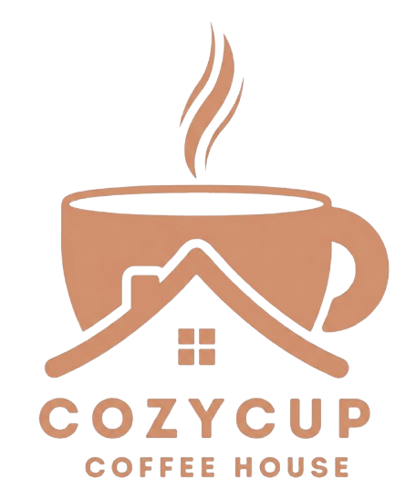
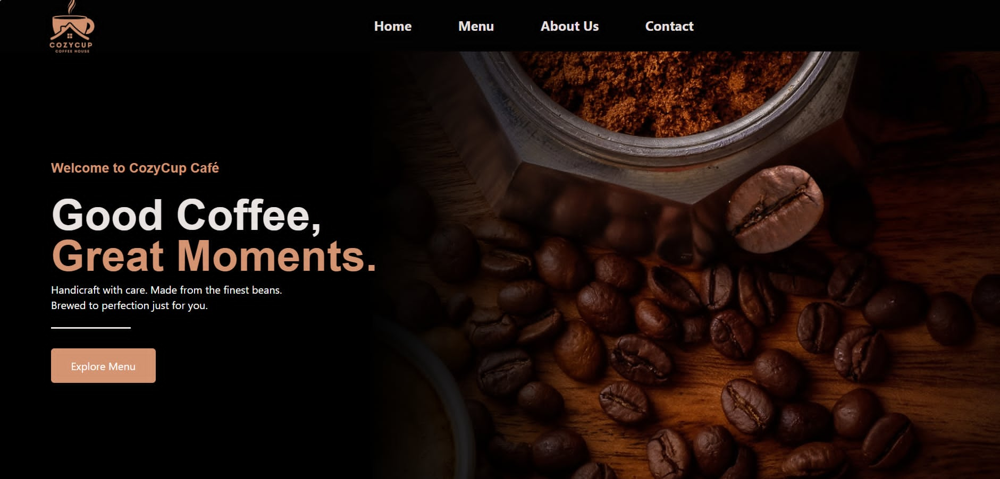
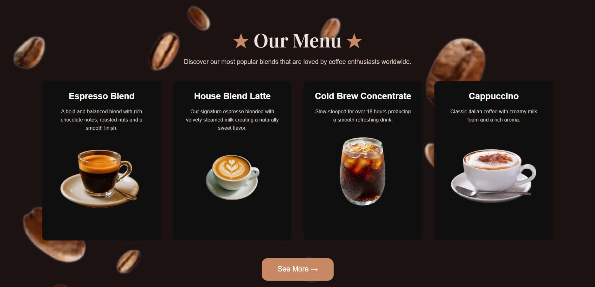
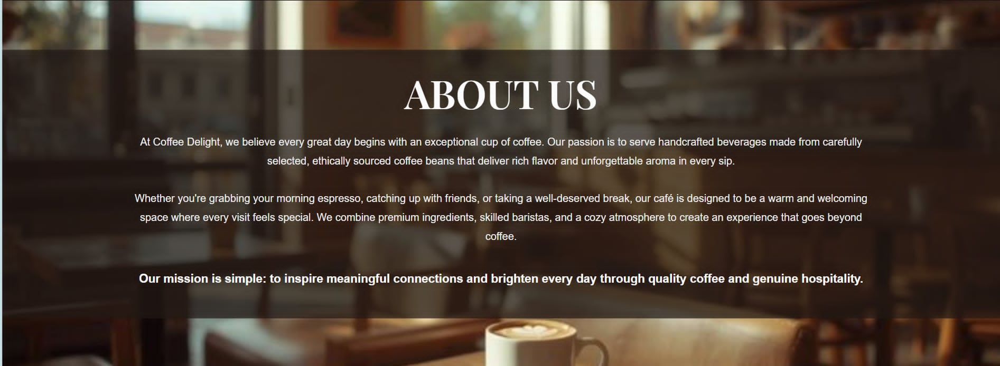

  

# Welcome to Cozy Cup Cafe!
 Where Every Sip Feels Like Home – Enjoy handcrafted coffee, delicious treats, and a warm atmosphere designed to make every visit relaxing, memorable, and comforting   
 ☕...💌 

## Project Description 
Experience the warmth of freshly brewed coffee, delicious pastries, and a cozy atmosphere—all in one place. This website lets you explore our menu, discover our story, and connect with us. Whether you're looking for your favorite coffee or a relaxing place to unwind, Cozy Cup Cafe is here to make every visit special.

## Features
- 🌐Responsive website design
- 🏠Home page with featured content
- 👥About Us section
- 🍵Coffee menu with images 
- 📞Contact information
- 📲User-friendly navigation
- 🍃Modern and clean interface

## Screen Captures
### Home Page

**Description:** The Home Page welcomes users to Cozy Cup Cafe with a warm and inviting design. It introduces the café, highlights featured products, and provides easy navigation to explore the rest of the website.

---

### Menu

 

**Description:** The Menu Page showcases the café's selection of coffee, beverages, and delicious food items. Each product is presented with its name, image, and price, making it easy for customers to browse and choose their favorites.

---

### About Us

**Description:** The About Us Page shares the story and mission of Cozy Cup Cafe. It introduces the café's commitment to serving quality coffee, creating a cozy atmosphere, and providing customers with a memorable dining experience.

---

### Contact Page

**Description:** The Contact Page allows customers to get in touch with Cozy Cup Cafe. It includes contact information, social media links, location details, and a contact form for inquiries, feedback, or reservations.

---

## About Authors
